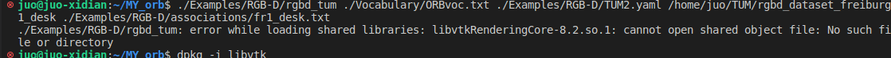
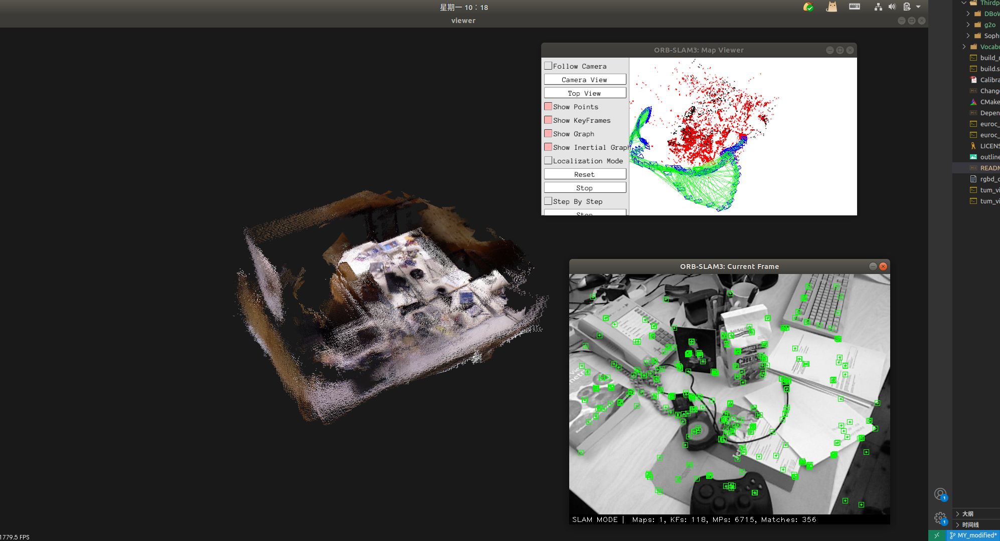

<!--
 * @Descripttion: 
 * @version: 
 * @Author: xp.Zhang
 * @Date: 2023-04-30 20:34:01
 * @LastEditors: xp.Zhang
 * @LastEditTime: 2023-05-01 10:10:21
-->

## 修改的代码上传过程


一共有四个仓库，前两个是本地仓库

上传时候需要

```
git push origin MY_modified:MY_modified
```

## 编译成功后，首次运行

可执行文件   词袋    相机配置文件    数据集位置        TUM数据集对齐文件

```
./Examples/RGB-D/rgbd_tum ./Vocabulary/ORBvoc.txt ./Examples/RGB-D/TUM1.yaml /home/juo/TUM/rgbd_dataset_freiburg1_desk ./Examples/RGB-D/associations/fr1_desk.txt
```

### 报错 没有将VTK 加载到环境变量中



```
gedit ~/.bashrc
```

在最后加入

```
# 设置vtkRendering的目录
export LD_LIBRARY_PATH=/usr/local/lib:$LD_LIBRARY_PATH
```

保存后更新环境变量

```
source ~/.bashrc
```

运行结果如下图所示



